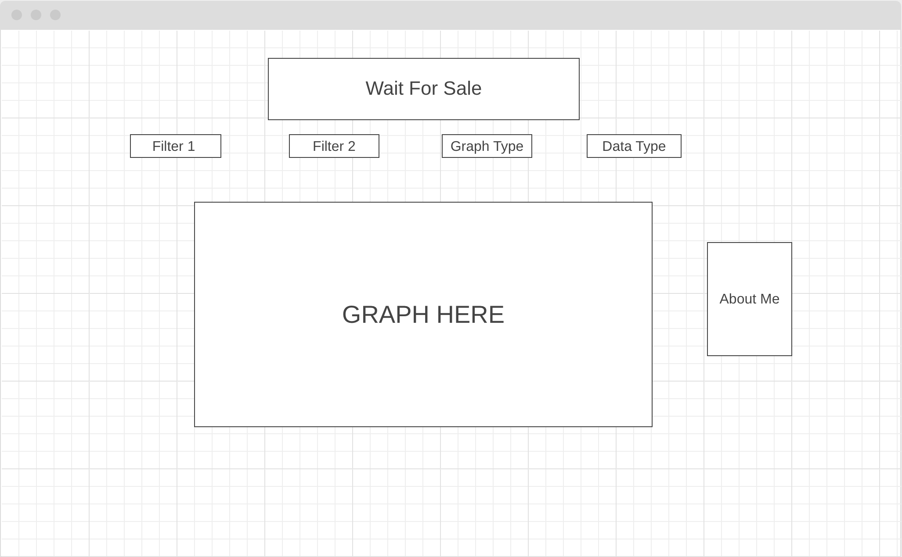

#this is a README
<h1>Background and Overview</h1>
Wait For Sale is an application to help users find the best steam games at the best price.
The applications main statistical chart graphs games by their price as well as their overall
steam rating. This is done using a scatter plot.This helps give users a feel for whether or not
their money is being well spent. The idea was inspired by the common practice of computer 
hardware influencers giving a price/performance rating on pieces of hardware. 

There are currently no services that are offering this specific statistic. 

The application also includes other criteria to filter by such as genre of game as well as pricepoint.
A filter by individual price or overall game rating is also possible in the form of bar graphs.

<h1>Functionality and MVPs</h1>
<ol>
    <li>The basic Bar Graph renders onto the screen and users can hover over different points of data, and see price and overall rating.</li>
    <li> Render and do calculations for the 3 different graphs
    <ul>
    <li>Price Graph: Renders the games with their price as the shown data.</li>
    <li>Rating Graph: Renders the games with their rating as the shown data.</li>
    <li>Rating/$ Graph: Scatter plot with the X axis being the rating of a game and the Y axis as the dollar price for a game.</li>
    </ul></li>
    <li>Filter Graphs based on different genres of game as well as game price.</li>
    <li>Be able to switch between dots and game images for the Rating/$ graph on all filters.</li>
</ol>

<h1>Wireframe</h1>

<h1>Architecture and Technology</h1>
<ul>
    <li>Vanilla Javascript</li>
    <li>CSS</li>
    <li>HTML</li>
    <li>Webpack</li>
    <li>Chart.js</li>
</ul>

<h1>Timeline</h1>
<h3>Day 1<h3>
<ul>
    <li>Learn github pages.</li>
    <li>Investigate Steam API</li>
    <li>Receive All JSON Data needed for project</li>
</ul>
<h3>Day 2<h3>
<ul>
    <li>Read Chart.js documentation</li>
    <li>Render a chart on the DOM</li>
    <li>Create first bar chart for price.</li>
</ul>
<h3>Day 3<h3>
<ul>
    <li>Work on filters for single graph.</li>
    <li>Implement other 2 graphs</li>
</ul>
<h3>Day 4<h3>
<ul>
    <li>Smooth transitions after different filters on graph.</li>
    <li>Make certain graphs dissappear depending on filter.</li>
    <li>Write about the game modal.</li>
    <li>Favicon and Page title</li>
    <li>Write production README</li>
</ul>

<h1>Bonus Features</h1>
<ul>
    <li>Render images for game points rather than just points.</li>
    <li>Have points be links to steam pages</li>
</ul>

